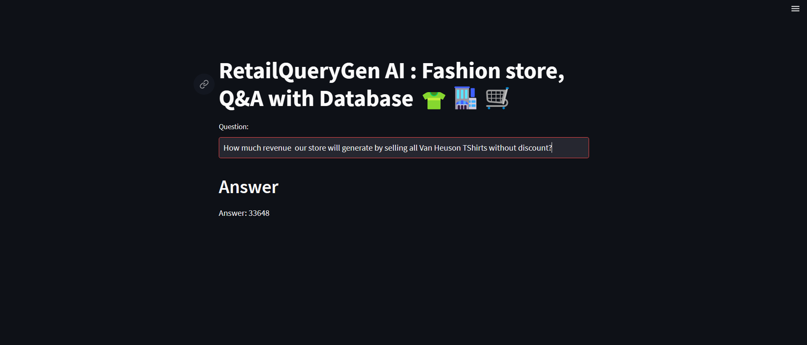
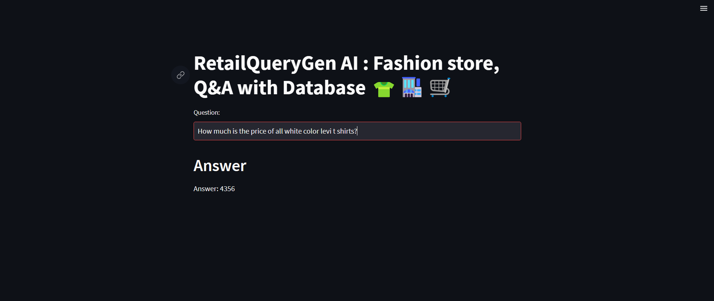
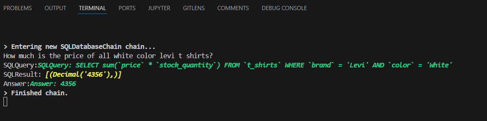
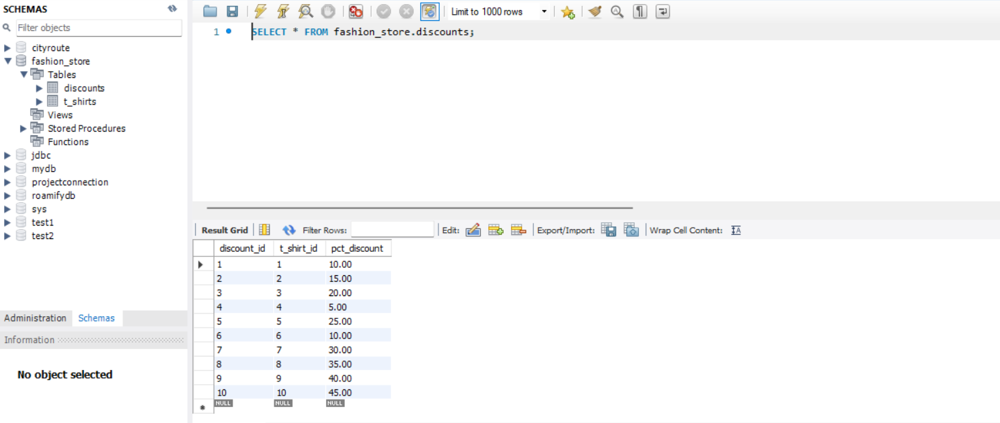
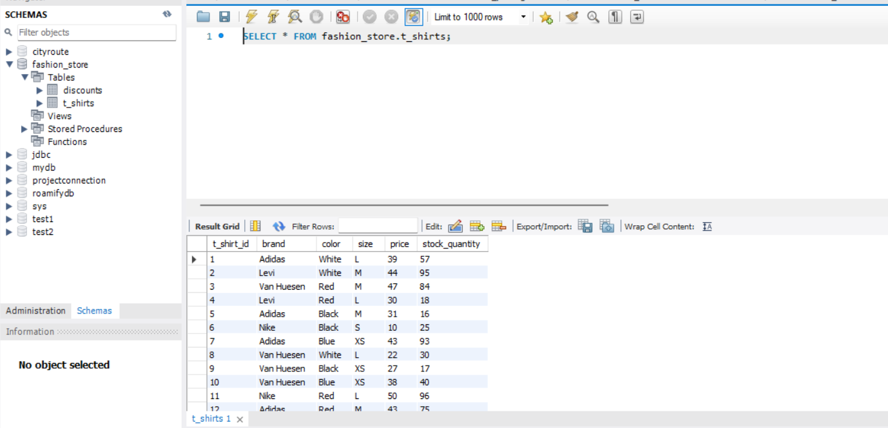

# RetailQueryGen AI


## Overview
RetailQueryGen AI is a powerful tool built to facilitate quick and accurate querying of a fashion store's database. Utilizing `Python, Streamlit, LangChain, GoogleGenerativeAI, gemini-1.5-flash , SQLDatabase, and FAISS`, the application provides an intuitive interface for querying specific details about inventory and sales data. By integrating advanced language models and vector storage technologies, the tool ensures precise and informative responses, empowering users to make informed decisions swiftly.

## Problem It’s Trying to Solve

 - etailers and shopkeepers often struggle to quickly access comprehensive information about their inventory, such as quantities, sizes, colors, and brands. This lack of real-time visibility can lead to stockouts or overstocking issues.
 - Planning effective daily sales strategies and promotional activities requires timely insights into product performance and sales trends. Without accurate data, retailers may miss opportunities to optimize revenue
 - Traditional methods of querying databases involve manually navigating complex structures, consuming valuable time that could be better spent on core business activities.
 - Complex databases and technical queries often hinder shopkeepers without technical expertise from effectively interpreting and utilizing critical business insights for decision-making.
 - RetailQueryGen AI addresses these challenges by providing an intuitive interface and leveraging advanced technologies to streamline data retrieval, optimize inventory management, and enhance sales planning capabilities for retail businesses.


## Features

#### 1. User-Friendly Interface:
- A clean and intuitive Streamlit interface.
- Input field for users to enter questions about the retail store data.

#### 2. Dynamic Query Processing:
- Utilizes SQLDatabase for querying the database and extracting relevant information.
- Supports dynamic question answering with real-time data retrieval.

#### 3. Advanced Embedding:
- Employs HuggingFaceEmbeddings with the sentence-transformers `all-MiniLM-l6-v2` model for robust text embeddings.
- Configurable model parameters and encoding options for optimized performance.

#### 4. Vector Store Integration:
- Integrates FAISS for efficient vector storage and retrieval.

#### 5. Open-Source Language Models:
- Utilizes `gemini-1.5-flash` open-source LLM for question answering and information retrieval, ensuring transparency and flexibility.
- Includes GoogleGenerativeAI for generating concise and accurate answers.

## Installation

#### 1. Clone the repository:

```
git clone https://github.com/theshubh007/RetailQueryGen-AI.git
```

#### 2. Create a virtual environment and activate it:

```
python -m venv venv
.\.venv\Scripts\activate
```

#### 3. Install the required packages:

```
pip install -r requirements.txt
```

#### 4. Create a .env file in the root directory and add your API key:

```
GOOGLE_GEMINI_API_KEY=your_google_gemini_api_key

```

#### 5. Run the Streamlit application:

```
streamlit run app.py

```


## Components

- Streamlit: Provides the interactive web interface.
- LangChain: Handles document loading, text splitting, and prompt management.
- SQLDatabase: Manages the SQL database connections and queries.
- HuggingFaceEmbeddings: Generates text embeddings using a pre-trained model.
- FAISS: Manages the vector storage and retrieval of document embeddings.
- GoogleGenerativeAI: Provides advanced language modeling for question answering.

## Future Enhancements
- Support for Additional Databases: Extend the tool to support various types of retail databases.
- Improved Query Generation: Enhance the logic for more complex and nuanced queries.
- Enhanced Visualization: Add more visualization options for the retrieved data and analysis results.

## Contribution
Contributions are welcome! Please submit a pull request or open an issue to discuss any changes.

#### Q&A On SQL database
-------------------------------------------------------------------------------------------------------
## Question: 1


## Question: 2


------------------------------------------------------------------------------------------------------

## Terminal logging view


------------------------------------------------------------------------------------------------------

## SQL Database





